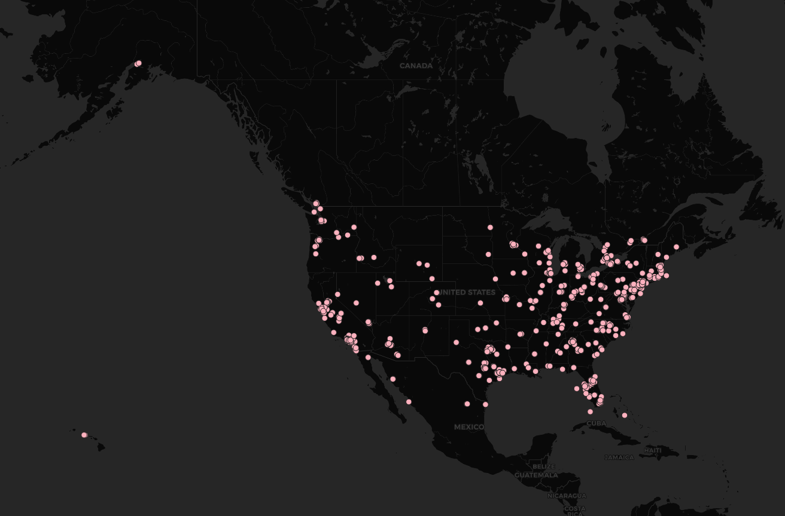

# GEOG 458: Lab 2 - Geo-tagged tweet collection and visualization
### Name: George Thompson
### Section: AA
#### Image of Map:

The collected tweets for the map involved the terms "Employment", "Job", and "Homeless" in order to find tweets related to the economic status of the United States. Due to the current circumstances related to the coronavirus, I sought out to see if there's a large presence of employment-related topics. As seen in the image, there is a larger presence of employment-related tweets in the eastern coast of the United States when compared to the western coast. There is a large absence of relevant tweets in the central region, but that may be due to a difference in population density when compared to other regions in the United States. More research is needed in order to use the given information to see if there's a high prevalence of economic issues in the United States.
